# **HostelX RGIPT - Hostel Management System**  
A comprehensive **hostel management system** for **Rajiv Gandhi Institute of Petroleum Technology (RGIPT)** that simplifies **room allocation, complaint tracking, leave requests, and announcements** for students and administrators.  

## **Overview**  
HostelX RGIPT is a **hostel management system** designed to streamline **room allocation, complaint tracking, leave requests, and announcements**, ensuring a **secure and efficient** experience for students and administrators. 

### Why HostelX?  
✔️ Reduces **manual workload** of hostel administration  
✔️ Provides a **centralized** platform for hostel-related tasks  
✔️ Ensures **secure and transparent** management  

## **Demo Screenshots**  

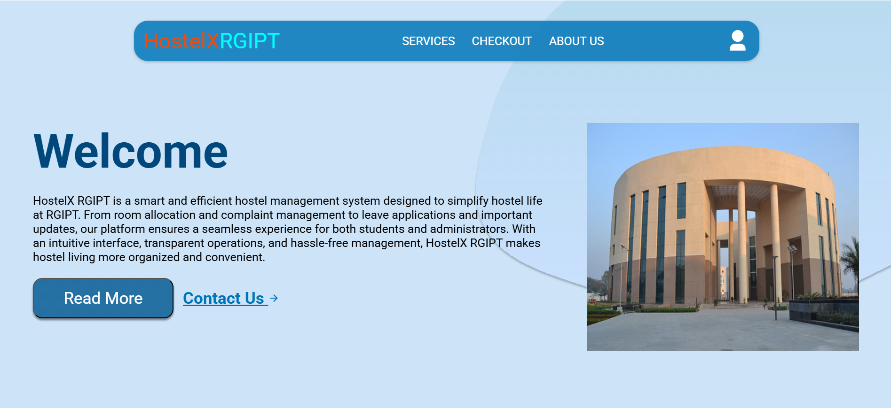  

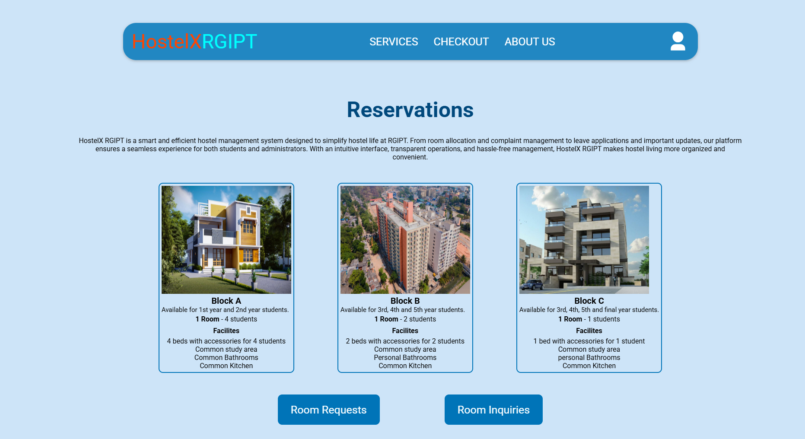  

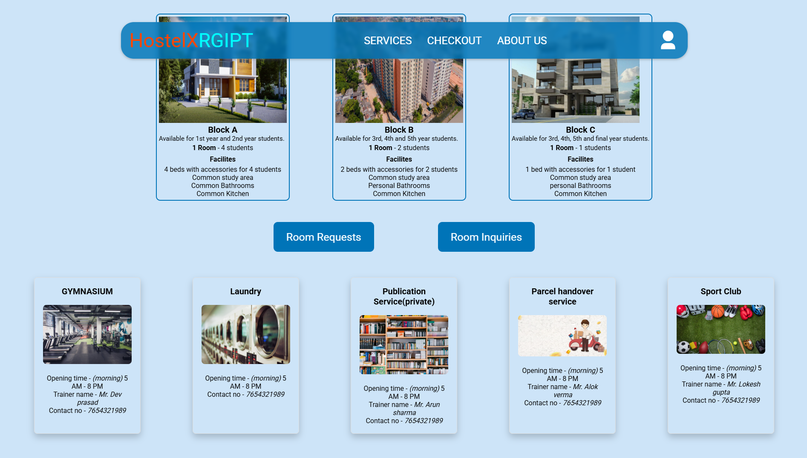  
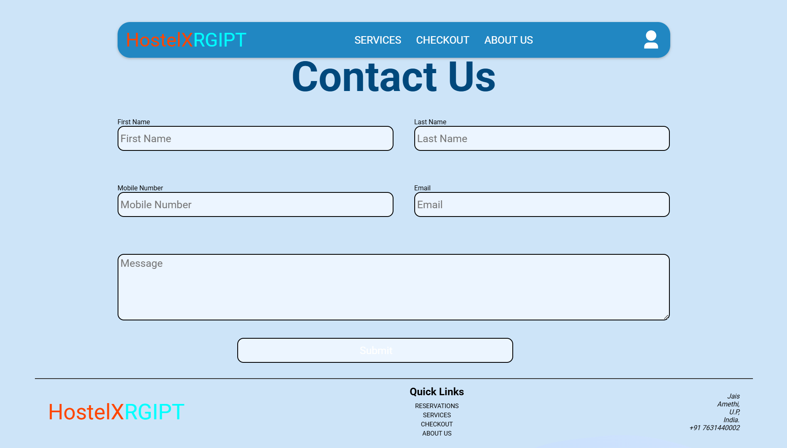  

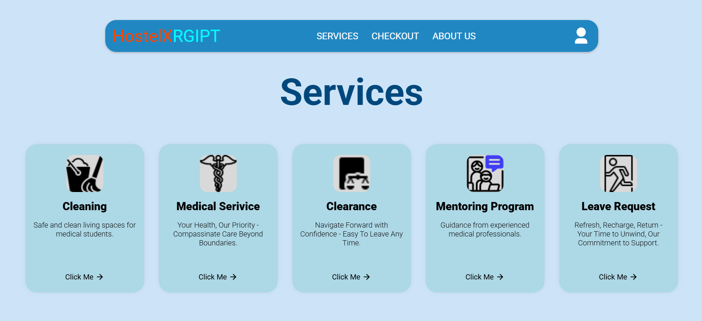  

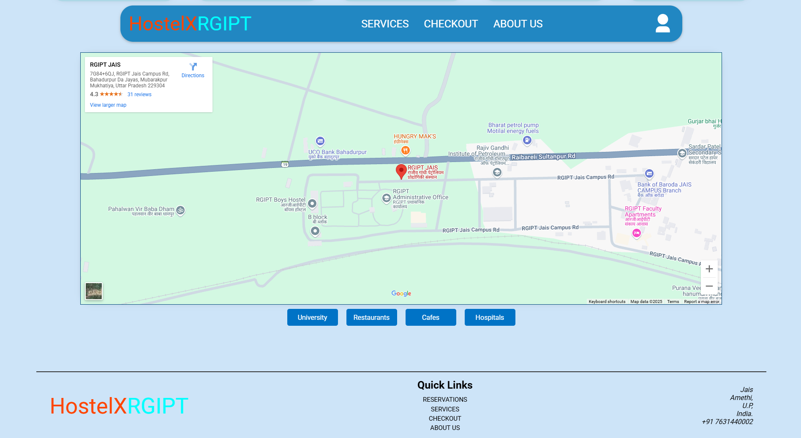  
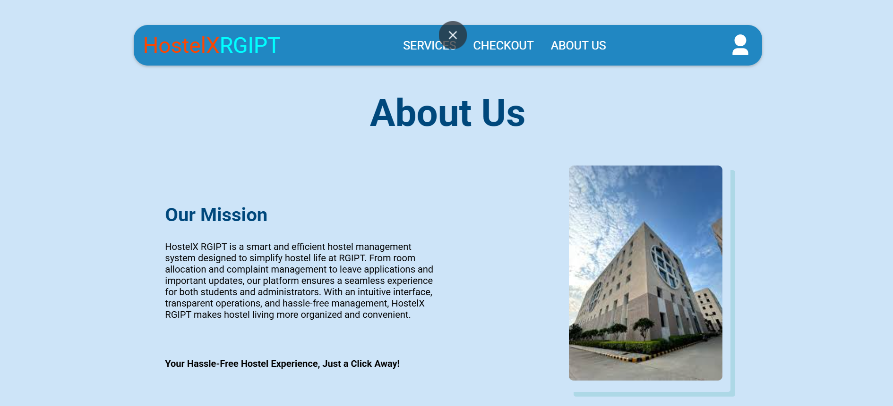  

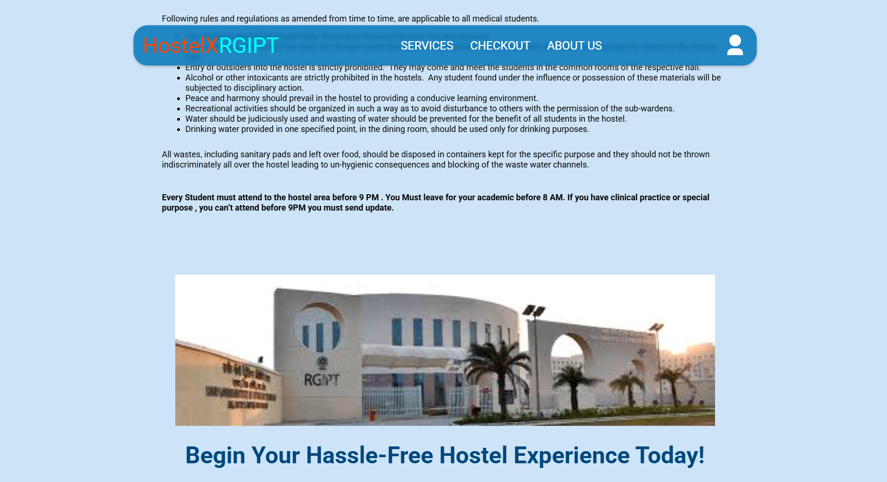  

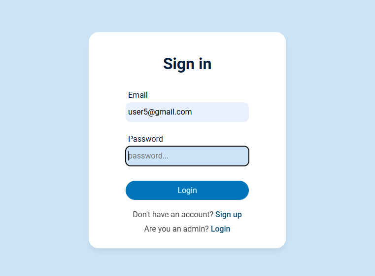  
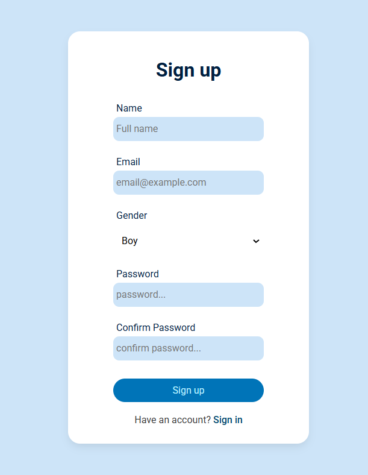  

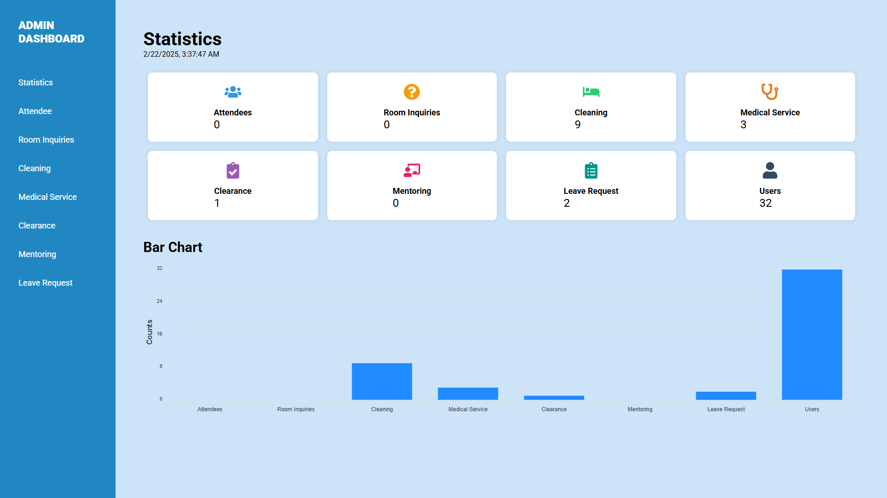  

---

 

## **Features**  
✅ **Room Allocation** – Assign and manage hostel rooms efficiently.  
✅ **Complaint Tracking** – Students can submit and track complaints.  
✅ **Leave Requests** – Apply for leave and get approvals seamlessly.  
✅ **Announcements** – Get real-time updates and notifications.  
✅ **Role-Based Authentication** – Ensures secure access.  
✅ **Real-Time Request Handling** – Structured request processing and record-keeping.  

## **Technologies Used**  
🛠️ **Frontend:** React.js, JavaScript, CSS, Bootstrap  
🛠️ **Backend:** Node.js, Express.js  
🛠️ **Database:** MongoDB  
🛠️ **APIs:** REST API  

## 📖 Usage Guide  

### 🎓 For Students  
- 🏠 **View Available Rooms** – Check hostel room availability  
- 📝 **Submit Complaints** – Raise maintenance issues & track status  
- 🚀 **Apply for Leave** – Submit requests & get admin approvals  
- 📢 **Stay Updated** – Receive real-time hostel announcements  

### 🎩 For Administrators  
- 📊 **Manage Room Allocation** – Assign & update hostel room details  
- 🔍 **Monitor Complaints** – View, manage, and resolve student issues  
- ✅ **Approve/Reject Leave Requests** – Easily review student leave applications  
- 📢 **Publish Announcements** – Post important updates  

---

## 📩 Contact & Support  
📧 **Email:** [bhartirounak@gmail.com](mailto:bhartirounak@gmail.com)  
🔗 **GitHub:** [https://github.com/rounakbharti](https://github.com/rounakbharti)  
🌐 **Project Repository:** [HostelX RGIPT](https://github.com/rounakbharti/HostelX-RGIPT)  

💡 *For any issues, feel free to open a GitHub issue!* 🚀  

