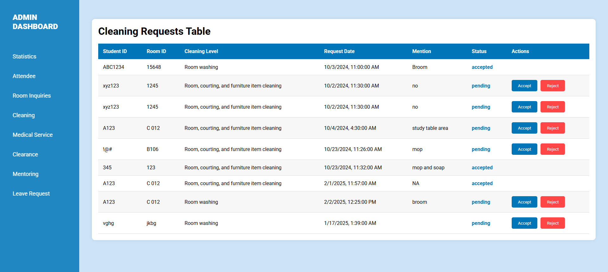
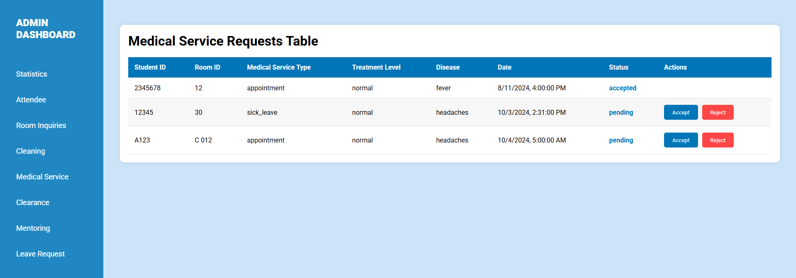
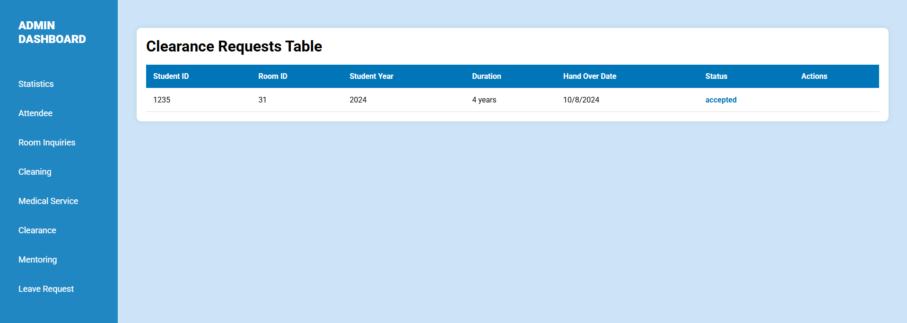

# **HostelX RGIPT - Hostel Management System**  

## **Overview**  
HostelX RGIPT is a **hostel management system** designed to streamline **room allocation, complaint tracking, leave requests, and announcements**, ensuring a **secure and efficient** experience for students and administrators. 

## **Demo Screenshots**  

  

  

  
  

  

  
  

  

  
  

  

  
  

  

  

*(Make sure the images are inside a `demo/` folder in your repository.)*  

---

 

## **Features**  
✅ **Room Allocation** – Assign and manage hostel rooms efficiently.  
✅ **Complaint Tracking** – Students can submit and track complaints.  
✅ **Leave Requests** – Apply for leave and get approvals seamlessly.  
✅ **Announcements** – Get real-time updates and notifications.  
✅ **Role-Based Authentication** – Ensures secure access.  
✅ **Real-Time Request Handling** – Structured request processing and record-keeping.  

## **Technologies Used**  
🛠️ **Frontend:** React.js, JavaScript, CSS, Bootstrap  
🛠️ **Backend:** Node.js, Express.js  
🛠️ **Database:** MongoDB  
🛠️ **APIs:** REST API  
